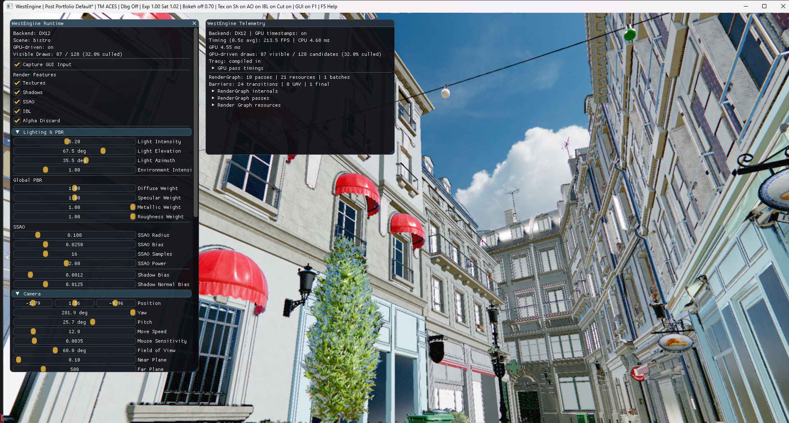

<h1 align="center">WestEngine</h1>

<p align="center">
  <b>DirectX 12 / Vulkan Dual-Backend Rendering Engine</b><br>
  Bindless RHI · Render Graph · GPU-Driven Rendering · Deferred PBR Pipeline
</p>

<p align="center">
  
</p>

---

## 프로젝트 소개

WestEngine은 **DirectX 12와 Vulkan 듀얼 백엔드**를 하나의 RHI(Rendering Hardware Interface)로 추상화한 렌더링 엔진입니다.

GPU 리소스 수명 관리, Render Graph 기반 프레임 실행, Bindless Descriptor Model, 2.84M triangles 규모 대형 Static Scene의 GPU-Driven 렌더링을 직접 설계하고 구현하였습니다.

주 타겟은 Windows PC 렌더링이지만, DX12/Vulkan 백엔드를 분리하고 DXIL/SPIR-V 외에 Metal Shading Language로의 크로스 컴파일을 지원하도록 설계했습니다. RHI에 `MetalDevice` 구현체를 추가하면 셰이더 파이프라인은 변경 없이 확장 가능한 구조를 목표로 합니다.

> **Demo Scene:** Amazon Lumberyard Bistro (약 2.84M triangles) — DX12/Vulkan 동일 코드 경로로 실행

https://casual-effects.com/data/ 의 Amazon Lumberyard Bistro 모델을 사용하였습니다.

---

## 핵심 기술 요약

| 영역 | 구현 내용 |
|---|---|
| **RHI 추상화** | `IRHIDevice`, `IRHICommandList`, `IRHIFence` 등 15개 인터페이스. 상위 코드에 DX12/Vulkan 타입이 노출되지 않음 |
| **Bindless 리소스 모델** | 엔진 전체가 **1개의 Global Root Signature / Descriptor Set Layout**을 공유. `BindlessIndex`로 리소스 접근 |
| **Render Graph** | Pass/Resource 의존성 선언 → 컴파일러가 barrier/transition 자동 해결. Transient resource aliasing 지원 |
| **GPU-Driven Rendering** | Compute Culling → `DrawIndexedIndirectCount` / `ExecuteIndirect`로 CPU draw call 제거 |
| **Deferred PBR Pipeline** | GBuffer → Shadow → SSAO → Deferred Lighting (PBR + IBL) → Bokeh DOF → Tone Mapping |
| **동기화** | Timeline Semaphore (`ID3D12Fence` / `VkTimelineSemaphore`) 기반 Triple Buffering + Fence-aware Deferred Deletion |
| **셰이더 파이프라인** | Slang 오프라인 컴파일 → DXIL + SPIR-V 동시 생성. CMake depfile 기반 증분 빌드 |
| **메모리 관리** | D3D12MA / VMA 통합. Linear / Pool / Stack 커스텀 할당기.|
| **텔레메트리** | Dear ImGui 기반 런타임 패널: GPU pass timing, RenderGraph 통계, GPU-driven draw count |

---

## 아키텍처

```
 Application / Win32 Runtime
          │
          ▼
  ┌─ west_rhi_interface ─────────────────────────────┐
  │  IRHIDevice · IRHICommandList · IRHIFence         │
  │  IRHISwapChain · IRHIPipeline · IRHIBuffer        │
  │  BindlessIndex (Resource / Sampler namespace)     │
  └──────────┬────────────────────────┬───────────────┘
             │                        │
             ▼                        ▼
     ┌─ DX12 Backend ──┐     ┌─ Vulkan 1.3 Backend ──┐
     │  D3D12MA        │     │  VMA                  │
     │  Descriptor Heap│     │  Descriptor Buffer    │
     │  D3D12 Fence    │     │  Timeline Semaphore   │
     │  Enhanced       │     │  Pipeline Barrier2    │
     │  Barriers       │     │                       │
     └────────┬────────┘     └────────┬──────────────┘
              │                       │
              └───────────┬───────────┘
                          ▼
              ┌─ Render Graph ────────────────────┐
              │  RenderGraphCompiler              │
              │  TransientResourcePool (aliasing) │
              │  CommandListPool                  │
              └────────────┬──────────────────────┘
                           ▼
    ┌──────────────────────────────────────────────┐
    │            Rendering Passes                  │
    │                                              │
    │  GPUDrivenCulling ──► GBuffer                │
    │                        │                     │
    │  ShadowMap ────────────┤                     │
    │                        ▼                     │
    │  SSAO ──────────► DeferredLighting           │
    │                        │                     │
    │                   BokehDOF                   │
    │                        │                     │
    │                   ToneMapping                │
    │                        │                     │
    │                   ImGui Overlay              │
    └──────────────────────────────────────────────┘
```
---

## 렌더링 파이프라인 상세

### 1. GPU-Driven Rendering

```
Scene Draw Records (GPU Buffer)
        │
        ▼
  ┌─ Compute Culling Pass ──┐
  │  Frustum Culling (AABB) │
  │  atomicAdd → visible ID │
  └────────┬────────────────┘
           ▼
  Indirect Arguments Buffer
  + Draw Count Buffer
           │
           ▼
  DrawIndexedIndirectCount (Vulkan)
  ExecuteIndirect (DX12)
```

- Bistro 기준: **22,396개 mesh/instance → 128개 merged draw unit**으로 압축
- GBuffer pass가 shared vertex/index buffer 1회 바인딩 후 indirect draw로 전체 씬 제출
- CPU draw loop 대비 submission collapse 달성

### 2. Deferred PBR Shading

| Pass | 출력 | 비고 |
|---|---|---|
| **GBuffer** | WorldPos · Normal · Albedo · Metallic/Roughness | Alpha discard (foliage/glass) 지원 |
| **ShadowMap** | Depth (directional) | 16-tap Rotated Poisson Disk PCF |
| **SSAO** | R16_FLOAT AO map | World-space position + normal 기반 |
| **DeferredLighting** | HDR scene color | Cook-Torrance BRDF (Trowbridge-Reitz GGX NDF + Smith-GGX Geometry + Fresnel-Schlick) + Fdez-Aguera multi-scattering 보정 |
| **IBL** | Diffuse irradiance + Specular GGX prefiltered cubemap + BRDF LUT | Split-sum approximation, HDR environment |
| **BokehDOF** | DOF 적용 HDR color | Hexagonal highlight-weighted blur, screen-center autofocus |
| **ToneMapping** | LDR back buffer | ACES / Reinhard / Uncharted2 / Gran Turismo / Lottes 등 9종 |

**후처리 스택:** Chromatic Aberration → FXAA → Tone Mapping → Color Grading (Contrast/Brightness/Saturation/Vibrance) → Vignette → Film Grain

### 3. Bindless RHI 모델

```
┌──────────────────────────────────────────────────────┐
│              Global Bindless Heap                    │
│                                                      │
│  BindlessIndex(0)   ── Scene Vertex Buffer (SRV)     │
│  BindlessIndex(1)   ── Scene Index Buffer (SRV)      │
│  BindlessIndex(2)   ── Material Buffer (SRV)         │
│  BindlessIndex(3~N) ── Material Textures (SRV)       │
│  ...                                                 │
│                                                      │
│  DX12: CBV/SRV/UAV Descriptor Heap                   │
│  Vulkan: VK_EXT_descriptor_buffer                    │
└──────────────────────────────────────────────────────┘
```

- Per-pass descriptor set 교체 없이 **push constant로 BindlessIndex만 전달**
- Vulkan의 `VK_KHR_buffer_device_address` 활용
- 셰이더 코드가 API-agnostic하게 리소스 접근
- **설계 의도:** Draw call 간 descriptor set 바인딩 교체를 제거하여 GPU command processor의 파이프라인 버블 최소화. 바인딩 모델이 아닌 인덱싱 모델이므로 Apple Silicon의 Argument Buffer에도 오버헤드 없이 매핑 가능

### 4. Render Graph

- **자동 Barrier 해결**: Pass가 리소스 사용 의도(Read/Write/RenderTarget)만 선언하면 컴파일러가 최적 state transition 삽입
- **DX12 Enhanced Barriers** (`ID3D12GraphicsCommandList7::Barrier`) 지원 + legacy fallback
- **Vulkan `vkCmdPipelineBarrier2`** 에 narrower stage mask 전달
- **Transient Resource Aliasing**: G-Buffer 등 동시에 alive하지 않는 render target들이 동일 VRAM 블록을 공유하여 peak memory 절감 (Aliasing Barrier)
- **런타임 통계**: Pass count, resource count, queue batch count, barrier count를 telemetry에 노출

### 5. 동기화 & 리소스 수명

- **Triple Buffering** + Timeline Fence/Semaphore 기반 Frame-in-Flight 동기화
- **Deferred Deletion**: GPU가 참조 중인 리소스를 fence 완료 전까지 삭제 지연
  - Bindless index unregister, transient render target, PSO, backend object 모두 적용
  - TDR(GPU Hang) 방지를 위한 핵심 안전장치

---

## 셰이더 빌드 파이프라인

```
 .slang 소스
     │
     ▼  
 Slang Compiler (slangc)
     │
     ├──► .dxil  (DX12 Shader Model 6.6)
     ├──► .spv   (Vulkan SPIR-V)
     └──► .json  (Reflection metadata)
              │
              ▼
     extract_metadata.py
              │
              ▼
     generated/ShaderMetadata.h
     (Compute workgroup sizes, push constant sizes)
```

- **Slang**: 하나의 셰이더 소스로 DXIL + SPIR-V 크로스 컴파일
- Reflection은 **metadata 추출 전용** — Global Descriptor Layout은 고정이므로 descriptor set 생성에 사용하지 않음

### Slang을 채택한 이유 (vs HLSL + DXC)

HLSL도 DXC를 통해 DXIL과 SPIR-V를 모두 생성할 수 있지만, 다음 이유로 Slang을 선택하였습니다:

| 비교 항목 | HLSL + DXC | Slang |
|---|---|---|
| **SPIR-V 경로** | DXC의 SPIR-V 백엔드는 공식 지원이 아닌 커뮤니티 유지보수. HLSL 시맨틱과 Vulkan 바인딩 모델 불일치로 `[[vk::binding]]` 등 Vulkan 전용 어노테이션 필요 | 네이티브 SPIR-V 백엔드. 바인딩 모델 변환을 컴파일러가 자동 처리 |
| **모듈 시스템** | `#include` 기반 텍스트 치환. 셰이더 간 공유 코드 관리에 한계 | `import` 기반 모듈 시스템. `import Common.GlobalBindless;`로 Bindless 배열 선언을 모든 셰이더에서 재사용 |
| **Uber-Shader 대안** | `#ifdef` 분기 폭발. GPU instruction cache 적중률 저하 | `interface` + generics로 **컴파일 타임 다형성** 지원. Specialization 자동 생성 |
| **크로스 플랫폼 확장** | MSL 미지원. Metal 포팅 시 별도 셰이더 작성 또는 SPIRV-Cross 의존 | DXIL · SPIR-V · **MSL** 크로스 컴파일 네이티브 지원. `MetalDevice` 추가 시 셰이더 변경 불필요 |
| **디버깅** | PIX에서 HLSL 소스 디버깅 지원 | `-Zi` 플래그로 PDB/디버그 심볼 생성. PIX · RenderDoc 모두 원본 Slang 소스로 매핑 |

---

## 프로젝트 구조

```
WestEngine/
├── engine/
│   ├── core/              # Logger, Assert, Timer, Types
│   │   ├── Memory/        # Linear / Pool / Stack 할당기
│   │   └── Threading/     # TaskSystem
│   ├── platform/          # IWindow, IApplication 추상화
│   │   └── win32/         # Win32 구현체 (OS 헤더 격리)
│   ├── rhi/
│   │   ├── interface/     # IRHIDevice, IRHICommandList 등 15개 인터페이스
│   │   ├── dx12/          # DX12 백엔드 (24 files)
│   │   ├── vulkan/        # Vulkan 1.3 백엔드 (25 files)
│   │   └── common/        # 공용 RHI 유틸리티
│   ├── render/
│   │   ├── RenderGraph/   # RenderGraph, Compiler, TransientResourcePool
│   │   └── Passes/        # GBuffer, Shadow, SSAO, Lighting, DOF, ToneMapping, GPUCulling
│   ├── scene/             # SceneAsset, MeshLoader (glTF/OBJ), Camera, Material
│   ├── shader/            # PSOCache, ShaderCompiler
│   └── editor/            # ImGui Renderer, Telemetry, Runtime Controls
├── shaders/               # Slang 셰이더 (11 passes + Common)
├── tools/                 # extract_metadata.py (Reflection → C++ header)
├── tests/                 # core / rhi / render / scene / shader 단위 테스트
├── generated/             # ShaderMetadata.h (빌드 시 자동 생성)
└── assets/                # Bistro, glTF canonical scene, IBL textures
```

---

## 측정 데이터

### Bistro Scene 로딩 최적화

| 최적화 단계 | DX12 | Vulkan |
|---|---:|---:|
| 최적화 전 (캐시 OFF, 배치 OFF) | 31,185 ms | 31,013 ms |
| + Texture Cache + Batch Upload | **2,406 ms** | **2,223 ms** |
| + 1024px 텍스처 해상도 제한 | **1,162 ms** | **997 ms** |

- Mesh/Instance 유닛: 22,396 → **128** (material + transform 기준 자동 merge)

### Runtime Performance

측정 기준:

- **Build:** Release
- **Scene:** Amazon Lumberyard Bistro, 1024px material texture cap, GPU-driven path ON
- **Resolution:** 1920x1080 client area
- **GPU:** NVIDIA GeForce RTX 3060
- **Validation / GPU crash diagnostics:** OFF
- **VSync:** OFF (현재 기본 swapchain 설정)
- **Command:** `--benchmark-runtime`
- **Sample:** warm-up 120 frames 이후 600 frames 측정, 3회 반복 중 median 값

#### Runtime Rendering Optimization Comparison

비교 기준:

- **Baseline:** `--disable-scene-cache --disable-scene-merge --disable-gpu-driven-scene`

| Backend | Path | Draw Units | GBuffer Submission | Avg FPS | CPU Avg | CPU P95 | GPU Avg | GPU P95 |
|---|---|---:|---|---:|---:|---:|---:|---:|
| **DX12** | Baseline | 22,396 | CPU direct draw loop | 174.3 | 5.736 ms | 9.447 ms | 4.207 ms | 4.552 ms |
| **DX12** | Optimized | 128 | GPU-driven indirect | **266.4** | **3.754 ms** | **4.075 ms** | **3.714 ms** | **4.047 ms** |
| **Vulkan** | Baseline | 22,396 | CPU direct draw loop | 191.1 | 5.232 ms | 5.797 ms | 4.497 ms | 4.720 ms |
| **Vulkan** | Optimized | 128 | GPU-driven indirect | **295.1** | **3.389 ms** | **3.550 ms** | **3.356 ms** | **3.489 ms** |

- DX12: FPS **+52.8%**, CPU Avg **-34.6%**, CPU P95 **-56.9%**, GPU Avg **-11.7%**
- Vulkan: FPS **+54.4%**, CPU Avg **-35.2%**, CPU P95 **-38.8%**, GPU Avg **-25.4%**

#### Final Optimized Path

| Backend | Avg FPS | CPU Avg | CPU P95 | GPU Avg | GPU P95 |
|---|---:|---:|---:|---:|---:|
| **DX12** | **266.4** | **3.754 ms** | **4.075 ms** | **3.714 ms** | **4.047 ms** |
| **Vulkan** | **295.1** | **3.389 ms** | **3.550 ms** | **3.356 ms** | **3.489 ms** |

> P95는 측정 프레임 중 95%가 해당 시간 이하로 완료되었음을 의미합니다.

### GPU-Driven Evidence

- GPU Compute Shader가 Frustum Culling을 수행하고, 결과를 Indirect Arguments Buffer에 기록
- GBuffer 패스는 128개 개별 draw call 대신 1회의 Indirect Draw 호출로 전체 씬을 처리 (DX12 ExecuteIndirect / Vulkan DrawIndexedIndirectCount)

---

## 기술 스택

| 분류 | 기술 |
|---|---|
| **언어** | C++20 (`std::span`, `std::format`, designated initializers, concepts), Slang (shader) |
| **Graphics API** | DirectX 12 (SM 6.8), Vulkan 1.3 |
| **빌드** | CMake 3.25+, vcpkg (manifest mode), CMake Presets |
| **메모리** | D3D12 Memory Allocator (D3D12MA), Vulkan Memory Allocator (VMA) |
| **셰이더** | Slang → DXIL + SPIR-V cross-compile |
| **UI** | Dear ImGui |
| **프로파일링** | Tracy (on-demand), GPU Timestamp Query |
| **씬 임포트** | Assimp (Bistro OBJ), cgltf (canonical glTF) |
| **텍스처** | stb_image, KTX2 (HDR cubemap) |

---

## 빌드 및 실행

### 요구 사항

- Windows 10/11
- Visual Studio 2022 (v143 toolset)
- CMake 3.25+
- Vulkan SDK 1.3+
- vcpkg (자동 의존성 관리)

### 빌드

```powershell
# Configure (vcpkg manifest 자동 설치)
cmake --preset default

# Build (Release)
cmake --build build --config Release -j
```

### 실행

```powershell
# DX12 백엔드 (기본)
build\bin\Release\west_engine.exe

# Vulkan 백엔드
build\bin\Release\west_engine.exe vulkan
```

### 조작키

| 키 | 기능 |
|---|---|
| `F1` | ImGui 패널 토글 |
| `F5` | 전체 핫키 도움말 |
| `F6` / `F7` | Post-Processing 프리셋 순환 / 초기화 |
| `F8` | Bokeh DOF 토글 |
| `F9` | Tone Mapping 알고리즘 순환 |
| `F10` / `F11` | Debug View / Channel 순환 |
| `1~0`, `J/K`, `V/B`, `O/P`, `N/M` | Exposure, Contrast, Saturation, Brightness, Vibrance, Chromatic Aberration, Film Grain 조절 |
